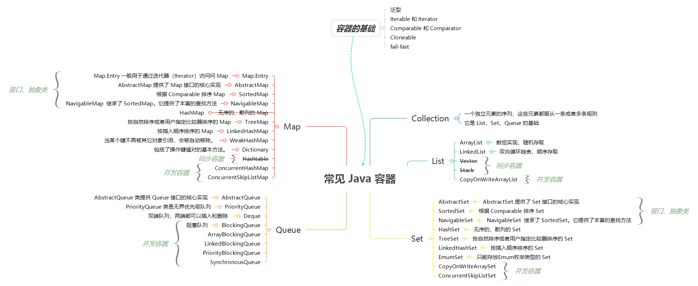

# Java 容器简介



## 容器简介

### 数组与容器

Java 中常用的存储容器就是数组和容器，二者有以下区别：

- 存储大小是否固定
  - 数组的**长度固定**；
  - 容器的**长度可变**。
- 数据类型
  - **数组可以存储基本数据类型，也可以存储引用数据类型**；
  - **容器只能存储引用数据类型**，基本数据类型的变量要转换成对应的包装类才能放入容器类中。

> :bulb: 不了解什么是基本数据类型、引用数据类型、包装类这些概念，可以参考：[Java 基本数据类型](https://dunwu.github.io/waterdrop/pages/55d693/)

### 容器框架


Java 容器框架主要分为 `Collection` 和 `Map` 两种。其中，`Collection` 又分为 `List`、`Set` 以及 `Queue`。

- `Collection` - 一个独立元素的序列，这些元素都服从一条或者多条规则。
  - `List` - 必须按照插入的顺序保存元素。
  - `Set` - 不能有重复的元素。
  - `Queue` - 按照排队规则来确定对象产生的顺序（通常与它们被插入的顺序相同）。
- `Map` - 一组成对的“键值对”对象，允许你使用键来查找值。

## 容器的基本机制

> Java 的容器具有一定的共性，它们或全部或部分依赖以下技术。所以，学习以下技术点，对于理解 Java 容器的特性和原理有很大的帮助。

### 泛型

Java 1.5 引入了泛型技术。

Java **容器通过泛型技术来保证其数据的类型安全**。什么是类型安全呢？

举例来说：如果有一个 `List<Object>` 容器，Java **编译器在编译时不会对原始类型进行类型安全检查**，却会对带参数的类型进行检查，通过使用 Object 作为类型，可以告知编译器该方法可以接受任何类型的对象，比如 String 或 Integer。

```java
List<Object> list = new ArrayList<Object>();
list.add("123");
list.add(123);
```

如果没有泛型技术，如示例中的代码那样，容器中就可能存储任意数据类型，这是很危险的行为。

```
List<String> list = new ArrayList<String>();
list.add("123");
list.add(123);
```

> :bulb: 想深入了解 Java 泛型技术的用法和原理可以参考：[深入理解 Java 泛型](https://dunwu.github.io/waterdrop/pages/33a820/)

### Iterable 和 Iterator

> Iterable 和 Iterator 目的在于遍历访问容器中的元素。

`Iterator` 接口定义：

```java
public interface Iterator<E> {

    boolean hasNext();

    E next();

    default void remove() {
        throw new UnsupportedOperationException("remove");
    }

    default void forEachRemaining(Consumer<? super E> action) {
        Objects.requireNonNull(action);
        while (hasNext())
            action.accept(next());
    }
}
```

`Iterable` 接口定义：

```java
public interface Iterable<T> {

    Iterator<T> iterator();

    default void forEach(Consumer<? super T> action) {
        Objects.requireNonNull(action);
        for (T t : this) {
            action.accept(t);
        }
    }

    default Spliterator<T> spliterator() {
        return Spliterators.spliteratorUnknownSize(iterator(), 0);
    }
}
```

`Collection` 接口扩展了 `Iterable` 接口。

迭代其实我们可以简单地理解为遍历，是一个标准化遍历各类容器里面的所有对象的接口。它是一个经典的设计模式——迭代器模式（Iterator）。

**迭代器模式** - **提供一种方法顺序访问一个聚合对象中各个元素，而又无须暴露该对象的内部表示**。

<div align="center">

</div>

示例：迭代器遍历

```java
public class IteratorDemo {

    public static void main(String[] args) {
        List<Integer> list = new ArrayList<>();
        list.add(1);
        list.add(2);
        list.add(3);
        Iterator it = list.iterator();
        while (it.hasNext()) {
            System.out.println(it.next());
        }
    }

}
```

### Comparable 和 Comparator

`Comparable` 是排序接口。若一个类实现了 `Comparable` 接口，表示该类的实例可以比较，也就意味着支持排序。实现了 `Comparable` 接口的类的对象的列表或数组可以通过 `Collections.sort` 或 `Arrays.sort` 进行自动排序。

`Comparable` 接口定义：

```java
public interface Comparable<T> {
    public int compareTo(T o);
}
```

`Comparator` 是比较接口，我们如果需要控制某个类的次序，而该类本身不支持排序(即没有实现 `Comparable` 接口)，那么我们就可以建立一个“该类的比较器”来进行排序，这个“比较器”只需要实现 `Comparator` 接口即可。也就是说，我们可以通过实现 `Comparator` 来新建一个比较器，然后通过这个比较器对类进行排序。

`Comparator` 接口定义：

```java
@FunctionalInterface
public interface Comparator<T> {

    int compare(T o1, T o2);

    boolean equals(Object obj);

    // 反转
    default Comparator<T> reversed() {
        return Collections.reverseOrder(this);
    }

    default Comparator<T> thenComparing(Comparator<? super T> other) {
        Objects.requireNonNull(other);
        return (Comparator<T> & Serializable) (c1, c2) -> {
            int res = compare(c1, c2);
            return (res != 0) ? res : other.compare(c1, c2);
        };
    }

    // thenComparingXXX 方法略

    // 静态方法略
}
```

在 Java 容器中，一些可以排序的容器，如 `TreeMap`、`TreeSet`，都可以通过传入 `Comparator`，来定义内部元素的排序规则。

### Cloneable

Java 中 一个类要实现 `clone` 功能 必须实现 `Cloneable` 接口，否则在调用 `clone()` 时会报 `CloneNotSupportedException` 异常。

Java 中所有类都默认继承 `java.lang.Object` 类，在 `java.lang.Object` 类中有一个方法 `clone()`，这个方法将返回 `Object` 对象的一个拷贝。`Object` 类里的 `clone()` 方法仅仅用于浅拷贝（拷贝基本成员属性，对于引用类型仅返回指向改地址的引用）。

如果 Java 类需要深拷贝，需要覆写 `clone()` 方法。

### fail-fast

#### fail-fast 的要点

Java 容器（如：ArrayList、HashMap、TreeSet 等待）的 javadoc 中常常提到类似的描述：

> 注意，迭代器的快速失败行为无法得到保证，因为一般来说，不可能对是否出现不同步并发修改做出任何硬性保证。快速失败（fail-fast）迭代器会尽最大努力抛出 `ConcurrentModificationException`。因此，为提高这类迭代器的正确性而编写一个依赖于此异常的程序是错误的做法：迭代器的快速失败行为应该仅用于检测 bug。

那么，我们不禁要问，什么是 fail-fast，为什么要有 fail-fast 机制？

**fail-fast 是 Java 容器的一种错误检测机制**。当多个线程对容器进行结构上的改变的操作时，就可能触发 fail-fast 机制。记住是有可能，而不是一定。

例如：假设存在两个线程（线程 1、线程 2），线程 1 通过 `Iterator` 在遍历容器 A 中的元素，在某个时候线程 2 修改了容器 A 的结构（是结构上面的修改，而不是简单的修改容器元素的内容），那么这个时候程序就会抛出 `ConcurrentModificationException` 异常，从而产生 fail-fast 机制。

**容器在迭代操作中改变元素个数（添加、删除元素）都可能会导致 fail-fast**。

示例：fail-fast 示例

```java
public class FailFastDemo {

    private static int MAX = 100;

    private static List<Integer> list = new ArrayList<>();

    public static void main(String[] args) {
        for (int i = 0; i < MAX; i++) {
            list.add(i);
        }
        new Thread(new MyThreadA()).start();
        new Thread(new MyThreadB()).start();
    }

    /** 迭代遍历容器所有元素 */
    static class MyThreadA implements Runnable {

        @Override
        public void run() {
            Iterator<Integer> iterator = list.iterator();
            while (iterator.hasNext()) {
                int i = iterator.next();
                System.out.println("MyThreadA 访问元素:" + i);
                try {
                    TimeUnit.MILLISECONDS.sleep(100);
                } catch (InterruptedException e) {
                    e.printStackTrace();
                }
            }
        }

    }

    /** 遍历删除指定范围内的所有偶数 */
    static class MyThreadB implements Runnable {

        @Override
        public void run() {
            int i = 0;
            while (i < MAX) {
                if (i % 2 == 0) {
                    System.out.println("MyThreadB 删除元素" + i);
                    list.remove(i);
                }
                i++;
            }
        }

    }

}
```

执行后，会抛出 `java.util.ConcurrentModificationException` 异常。

#### 解决 fail-fast

fail-fast 有两种解决方案：

- 在遍历过程中所有涉及到改变容器个数的地方全部加上 `synchronized` 或者直接使用 `Collections.synchronizedXXX` 容器，这样就可以解决。但是不推荐，因为增删造成的同步锁可能会阻塞遍历操作，影响吞吐。
- 使用并发容器，如：`CopyOnWriterArrayList`。

## 容器和线程安全

为了在并发环境下安全地使用容器，Java 提供了同步容器和并发容器。

> 同步容器和并发容器详情请参考：[Java 并发容器](https://dunwu.github.io/waterdrop/pages/b067d6/)

## 参考资料

- [Java 编程思想（第 4 版）](https://item.jd.com/10058164.html)
- [由浅入深理解 java 集合(一)——集合框架 Collection、Map](https://www.jianshu.com/p/589d58033841)
- [由浅入深理解 java 集合(二)——集合 Set](https://www.jianshu.com/p/9081017a2d67)
- [Java 提高篇（三十）-----Iterator](https://www.cnblogs.com/chenssy/p/3821328.html)
- [Java 提高篇（三四）-----fail-fast 机制](https://blog.csdn.net/chenssy/article/details/38151189)