## cdn 概述和分析
通过 CDN（内容分发网络）将静态资源缓存到全球节点，显著提升访问速度。

1. Cloudflare 加速

优点：免费，全球节点多，支持 HTTPS。

注意：国内用户访问 Cloudflare 节点可能仍有延迟，但对海外用户效果显著。

2. 国内 CDN 服务（需备案）
如果用户主要在国内，可使用阿里云、腾讯云 CDN，但需域名备案。备案特别麻烦，主要是需要花钱，可以参考：https://blog.csdn.net/lion_no_back/article/details/131075457


综上，使用 cdn  提升 github pages 访问速度慢的问题，对比国内（腾讯、阿里云）和国外 cloudflare ，最终选择使用 cloudflare。


## 阿里云域名获取

访问阿里云官网获取：https://wanwang.aliyun.com/domain
身份验证需要花费半小时的时间。

## 添加域名的 DNS 记录

域名购买成功后，且状态为正常。点击操作中的“解析”菜单，进入DNS配置操作。

添加两个记录，添加完成后需要等待，可以点击左上方“域名解析问题详细诊断”，查看结果。如图
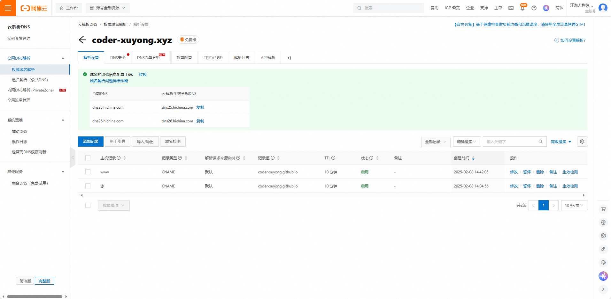


## github pages 绑定域名
将配置好的域名绑定到 github pages 中。并且勾选 Enforce HTTPS  。如图：
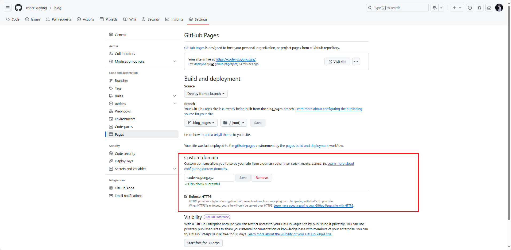

修改成功后，便可通过域名访问。
## 修改base路径

访问之后样式不对，缺少东西，是其他js和css的请求路径不对，多了一个 “blog”。
将 config.ts 中的 base 改为："/"
提交代码，pages action 部署之后，访问没有异常，便是成功部署完成。

## 绑定 cloudflare CDN
访问官网：https://www.cloudflare-cn.com/
点击右上角登陆，可能需要科学上网。
使用 Google 或者 apple 账号登陆。
登陆成功后，右上角可以选择切换中文。

添加域名，就是刚刚购买的，或者已拥有的
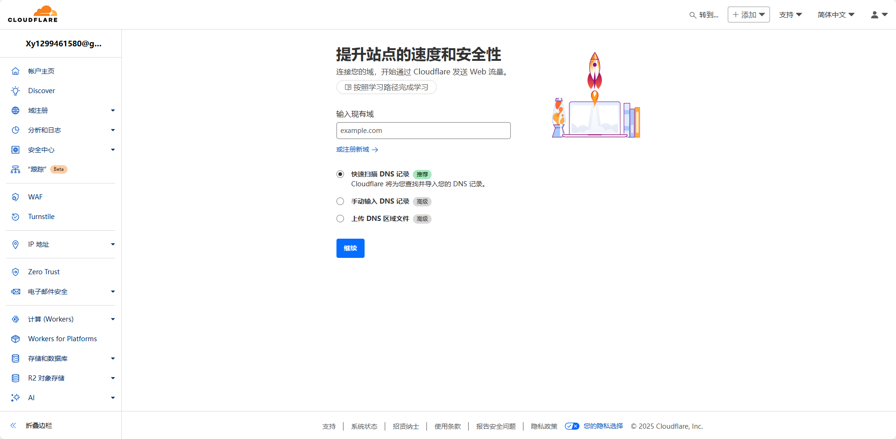
选择免费，点击继续

添加四个记录IP，类型为A 地址如下：
```shell
185.199.108.153
185.199.109.153
185.199.110.153
185.199.111.153
```
这是github pages 的地址，可以官网查看：https://docs.github.com/zh/pages/configuring-a-custom-domain-for-your-github-pages-site/managing-a-custom-domain-for-your-github-pages-site

配置完成后，继续下一步


看提示，登陆阿里云的域名控制台，取保关闭了 DNSSEC （就是关闭 DNS 安全）；然后修改 DNS （从域名列表的操作菜单中的管理进去），将DNS改为如图中的两个。


完成之后需要等待一段时间，可以点击 立即检查名称服务器 查看结果；也可以在阿里云 云解析DNS/权威域名解析/解析设置 中查看。


## Cloudflare github pages 部署步骤（了解）

使用了这一步，就不需要绑定github pages了，相当于同一个功能，只是必须绑定域名

登陆成功后

选择 计算(Workers)/Worker 和 pages，如下图所示
 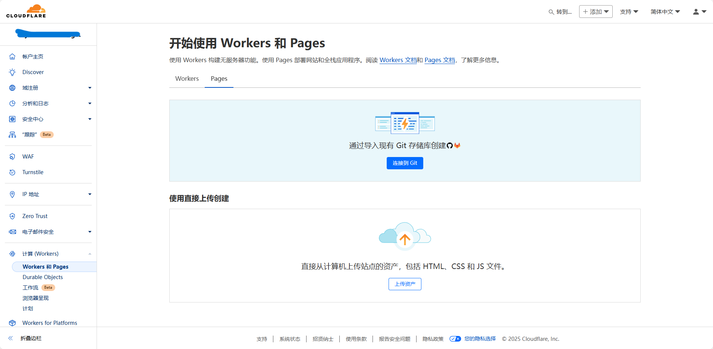

选择pages，连接 git 
  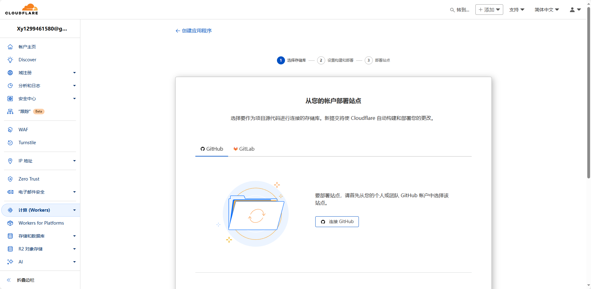
选择github，连接github，登陆之后选择仓库
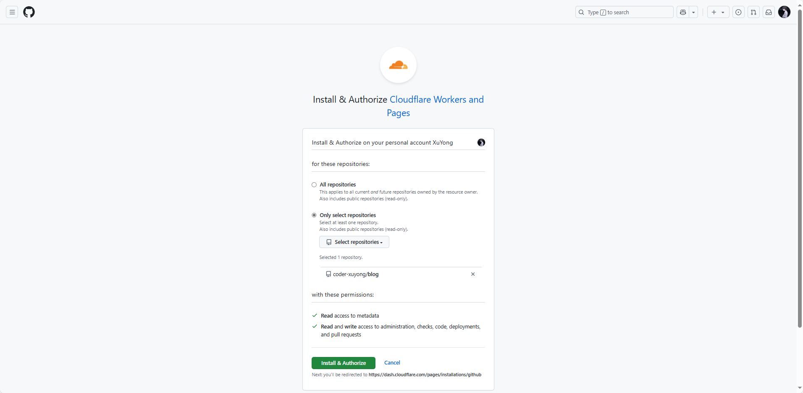
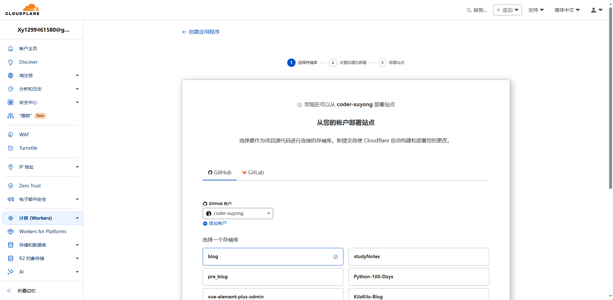
选择分支，确认构建命令和打包目录
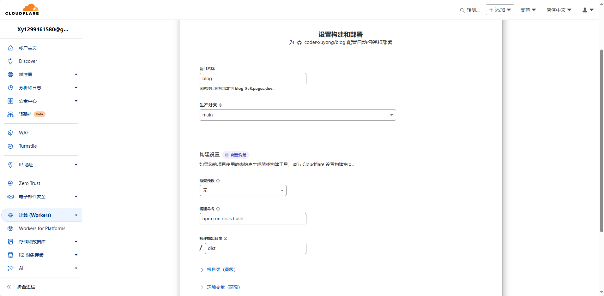
出现构建错误
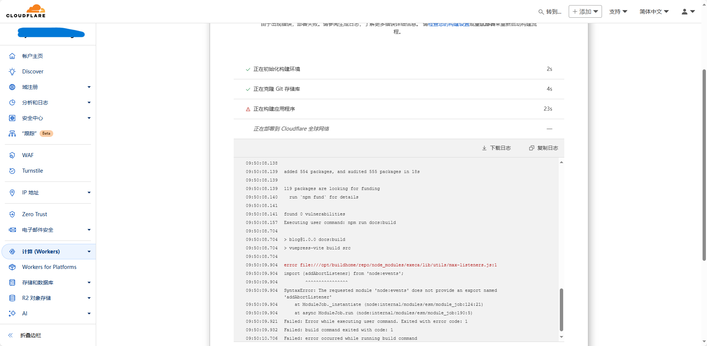
需要自定义 node 版本
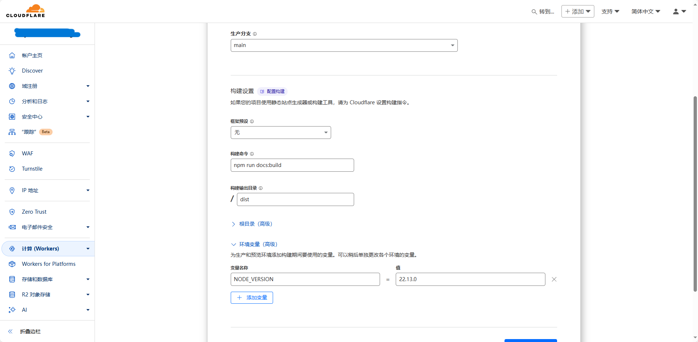
但又出现了找不到打包目录的错误
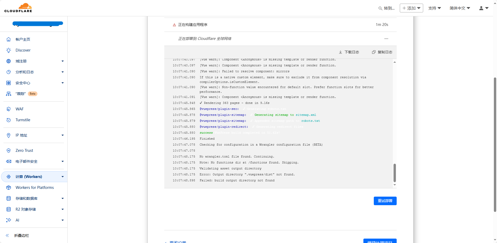
修改构建输出目录
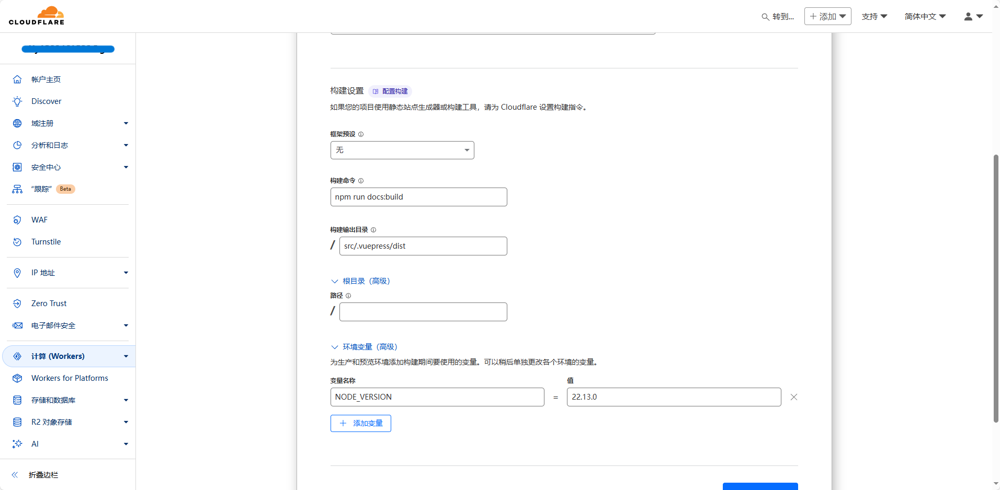
构建成功
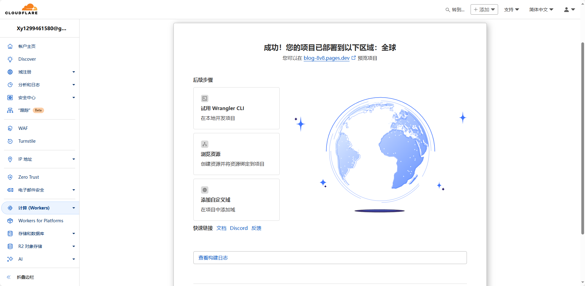
可以访问 dev 结尾的网址预览项目

后续上传代码到github上，会自动打包
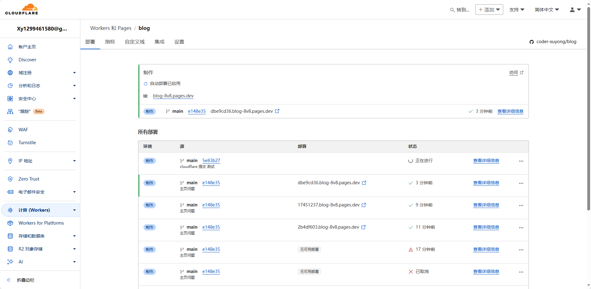

## 参考
> https://blog.csdn.net/lion_no_back/article/details/131075457
> https://blog.csdn.net/abjtxf/article/details/145431226
> https://qinyu.space/%E5%8D%9A%E5%AE%A2%E6%90%AD%E5%BB%BA/%E5%88%A9%E7%94%A8cloudflare%E5%8A%A0%E9%80%9Fgithub%E4%B8%BB%E9%A1%B5%E8%AE%BF%E9%97%AE/#